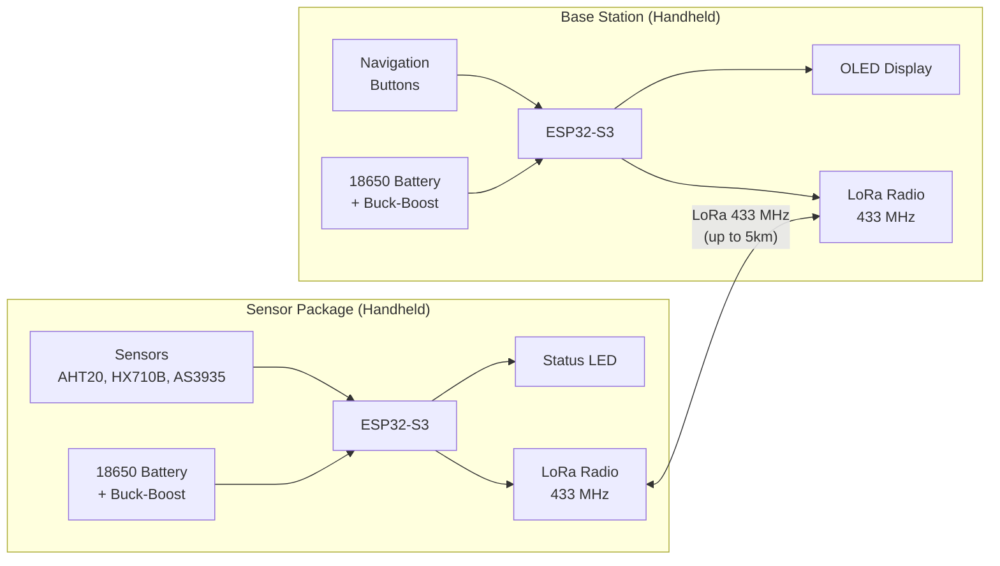
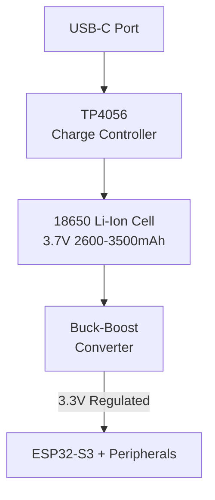
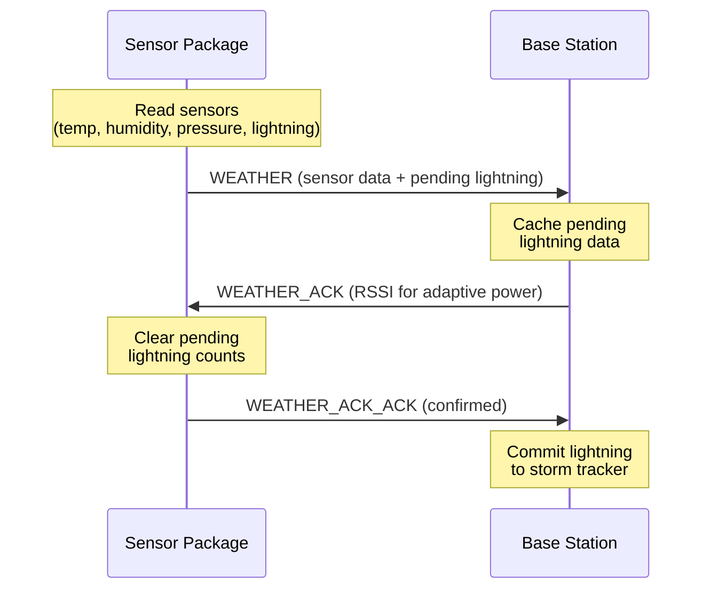
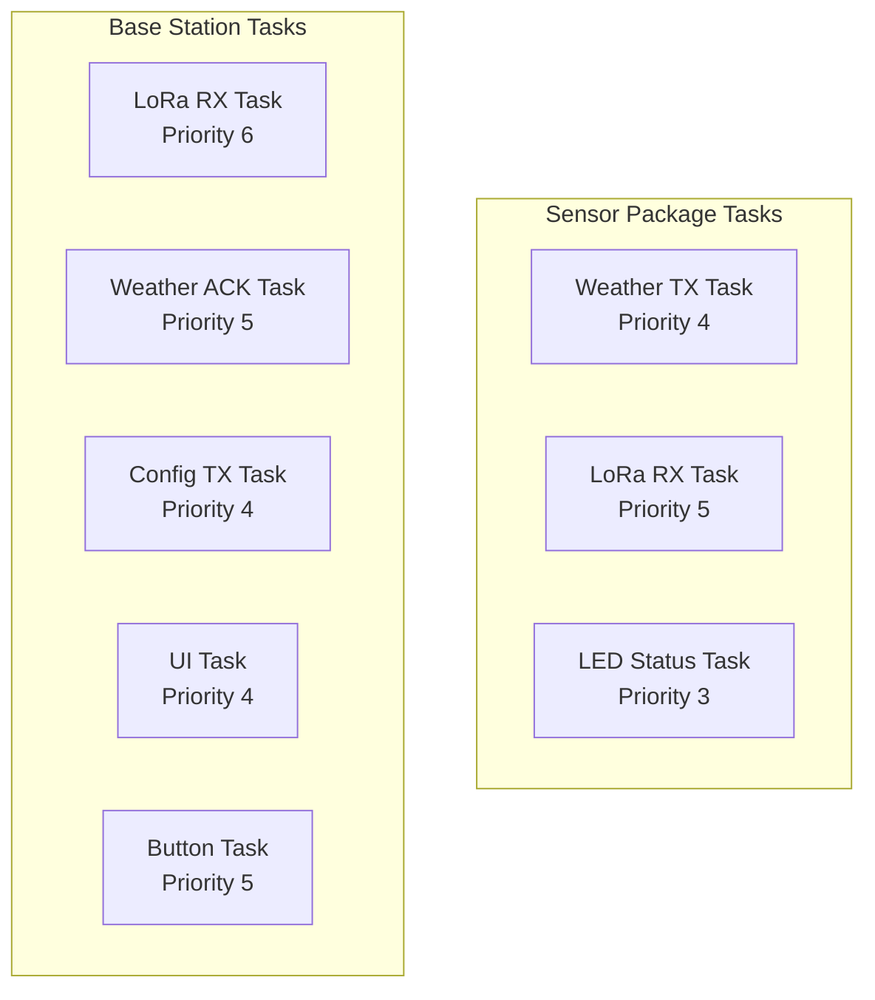

# WeatherKit - Portable Survivalist Weather Station

<p align="center">
  <a href="https://github.com/Mikecerc/weatherKit/actions/workflows/build.yml"></a>
  
  
  
  
  
</p>

A two-unit, portable, battery-powered weather station system designed for **off-grid outdoor use**. Built on ESP32-S3 microcontrollers with LoRa-based long-range communication, real-time weather monitoring, lightning detection, and storm tracking capabilities. Perfect for hikers, campers, survivalists, and anyone who needs reliable weather awareness in remote locations.

## � Project Scope

WeatherKit is designed as a **portable survivalist weather monitoring system** for outdoor and off-grid scenarios:

- **Use Case:** Backpacking, camping, emergency preparedness, field research
- **Environment:** Fully outdoor-rated, both units are handheld and weather-resistant
- **Power:** Each unit is powered by a rechargeable 18650 lithium cell with integrated charge controller and buck-boost regulation
- **Range:** LoRa communication enables monitoring over several kilometers
- **Safety Focus:** Lightning detection and storm tracking to help users find shelter before dangerous weather arrives

## 🌡️ Overview

WeatherKit consists of two independent handheld units that communicate wirelessly over LoRa:



| Unit | Description | Form Factor |
|------|-------------|-------------|
| **Sensor Package** | Handheld sensor unit that reads temperature, humidity, pressure, and lightning data | Portable, battery-powered |
| **Base Station** | Handheld display unit with OLED screen, user controls, and storm tracking | Portable, battery-powered |

The system uses a custom three-way handshake protocol over LoRa at 433 MHz to ensure reliable data delivery, including lightning event tracking without duplicate counting.

## ✨ Features

### Sensor Package
- **Temperature & Humidity** - AHT20 sensor with high precision
- **Barometric Pressure** - HX710B pressure sensor for altitude and weather prediction
- **Lightning Detection** - AS3935 Franklin Lightning Sensor for storm tracking
- **Adaptive TX Power** - Automatically adjusts transmission power to conserve battery
- **Configuration Persistence** - Settings saved to NVS flash
- **LED Status Indicators** - Visual feedback for connection status and packet transmission
- **18650 Battery Power** - Rechargeable lithium cell with USB-C charging

### Base Station
- **128x64 OLED Display** - Real-time weather data visualization (sunlight readable)
- **Multi-Page UI** - Main display, lightning map, storm tracker, sensor status, settings
- **Storm Tracking** - Historical lightning data with distance estimation and risk assessment
- **Two-Button Navigation** - Intuitive interface with short/long press actions
- **Standby Mode** - Power-saving display off mode while maintaining data reception
- **Remote Sensor Configuration** - Adjust sensor parameters wirelessly
- **18650 Battery Power** - Rechargeable lithium cell with USB-C charging

### Communication Protocol
- **LoRa 433 MHz** - Long-range, low-power wireless communication (up to 5km line-of-sight)
- **Three-Way Handshake** - Reliable data delivery with acknowledgment
- **Sequence Numbers** - Duplicate packet detection
- **Adaptive Power Control** - Dynamic TX power based on RSSI feedback (extends battery life)

## 🔋 Power System

Both units feature identical power systems for field serviceability:



| Specification | Value |
|---------------|-------|
| Battery Type | 18650 Li-Ion (rechargeable) |
| Nominal Voltage | 3.7V |
| Capacity | 2600-3500 mAh (cell dependent) |
| Charging | USB-C via TP4056 or similar |
| Regulation | Buck-boost to 3.3V |
| Runtime (Sensor) | ~24-48 hours (30s interval) |
| Runtime (Base) | ~12-24 hours (display on) |

## 📁 Project Structure

```
weatherKit/
├── README.md                      # This file
├── docs/
│   ├── SOFTWARE_ARCHITECTURE.md   # Detailed software flowcharts
│   └── HARDWARE_ARCHITECTURE.md   # Hardware design and wiring
├── baseStation/                   # Base Station (Display Unit)
│   ├── README.md                  # Base station documentation
│   ├── main/
│   │   ├── src/                   # Application source code
│   │   ├── include/               # Header files
│   │   ├── drivers/               # LoRa and display drivers
│   │   ├── ui/                    # User interface components
│   │   └── tasks/                 # FreeRTOS task implementations
│   └── build/                     # Build output
└── sensorPackage/                 # Sensor Package Unit
    ├── README.md                  # Sensor package documentation
    ├── main/
    │   ├── src/                   # Application source code
    │   ├── include/               # Header files
    │   ├── drivers/               # Sensor and LoRa drivers
    │   └── tasks/                 # FreeRTOS task implementations
    └── build/                     # Build output
```

> **Note:** This is a multi-MCU project with two separate ESP-IDF projects. This is the recommended structure for ESP-IDF when targeting different hardware configurations, as each unit has its own `sdkconfig` and build directory. Shared code (like protocol definitions) can be placed in a `components/` folder.

## 🚀 Getting Started

### Prerequisites

- **ESP-IDF v5.x** - Espressif IoT Development Framework
- **Python 3.8+** - For ESP-IDF tools
- **USB-C Cable** - For programming and charging

### Hardware Requirements

| Component | Sensor Package | Base Station |
|-----------|---------------|--------------|
| **MCU** | ESP32-S3FH4R2 (4MB Flash, 2MB PSRAM) | Waveshare ESP32-S3-Zero |
| **LoRa** | SX1278/RA-02 Module (433 MHz) | SX1278/RA-02 Module (433 MHz) |
| **Display** | - | SSD1306 128x64 OLED |
| **Sensors** | AHT20, HX710B, AS3935 | - |
| **Input** | - | 2x Push Buttons |
| **Indicators** | WS2812 RGB LED | - |
| **Battery** | 18650 Li-Ion Cell | 18650 Li-Ion Cell |
| **Power** | TP4056 + Buck-Boost | TP4056 + Buck-Boost |

### Building

#### Using the Build Script (Recommended)

A comprehensive build script is provided for easy building, flashing, and monitoring:

```bash
# Make the script executable (first time only)
chmod +x build.sh

# Build all projects
./build.sh build -p all

# Build individual projects
./build.sh build -p sensor     # Build sensor package only
./build.sh build -p base       # Build base station only

# Flash a specific project
./build.sh flash -p sensor -d /dev/ttyUSB0
./build.sh flash -p base -d /dev/ttyUSB1

# Flash and monitor
./build.sh flash-monitor -p sensor -d /dev/ttyUSB0

# Monitor serial output
./build.sh monitor -p base -d /dev/ttyUSB1

# Clean builds
./build.sh clean -p all
./build.sh fullclean -p all

# Open menuconfig
./build.sh menuconfig -p sensor
```

Run `./build.sh --help` for full usage information.

#### Manual Build

1. **Set up ESP-IDF environment:**
   ```bash
   . $IDF_PATH/export.sh
   ```

2. **Build and flash the Sensor Package:**
   ```bash
   cd sensorPackage
   idf.py build
   idf.py -p /dev/ttyUSB0 flash monitor
   ```

3. **Build and flash the Base Station:**
   ```bash
   cd baseStation
   idf.py build
   idf.py -p /dev/ttyUSB1 flash monitor
   ```

### Configuration

Both units can be configured:

- **Sensor Package:** Configuration received from base station via LoRa, persisted in NVS
- **Base Station:** Settings accessible through the on-device UI menu

Configurable parameters include:
- Update interval (5-300 seconds) - longer intervals extend battery life
- TX power mode (normal/high power)
- Adaptive power enable/disable
- Display brightness
- Locate buzzer (for finding sensor)

## 📡 Communication Protocol

The WeatherKit uses a custom LoRa protocol with a three-way handshake for reliable lightning data delivery:



| Packet Type | Direction | Purpose |
|-------------|-----------|---------|
| `WEATHER` | Sensor → Base | Weather data (temp, humidity, pressure, lightning) |
| `WEATHER_ACK` | Base → Sensor | Acknowledge weather packet, include RSSI |
| `WEATHER_ACK_ACK` | Sensor → Base | Confirm ACK received, commit lightning data |
| `CONFIG` | Base → Sensor | Configuration update |
| `CONFIG_ACK` | Sensor → Base | Confirm config applied |

See [SOFTWARE_ARCHITECTURE.md](docs/SOFTWARE_ARCHITECTURE.md) for detailed protocol flowcharts.

## 🔧 Development

### Task Architecture



**Sensor Package (3 tasks):**
- `weather_tx_task` - Reads sensors and transmits data
- `lora_rx_task` - Receives ACKs and config packets
- `led_status_task` - LED indicator management

**Base Station (5 tasks):**
- `lora_rx_task` - Receives weather data
- `weather_ack_task` - Sends ACKs with retry logic
- `config_tx_task` - Transmits configuration changes
- `ui_task` - Display updates
- `button_task` - User input handling

### Debugging

Monitor logs with:
```bash
idf.py monitor
```

Key log tags:
- `main` - Application entry and status
- `lora` - LoRa communication
- `weather_tx` / `lora_rx` - Task-specific logs
- `ui` - User interface events

## 🌩️ Storm Safety Features

The primary purpose of WeatherKit is to help users stay safe in changing weather conditions:

- **Lightning Distance Tracking** - Know how far away strikes are occurring
- **Storm Approach Detection** - Track if lightning is getting closer
- **Pressure Trend Analysis** - Rapid pressure drops indicate incoming storms
- **Visual Alerts** - LED flashes and display warnings for dangerous conditions

## 📚 Documentation

- [Software Architecture](docs/SOFTWARE_ARCHITECTURE.md) - Detailed task flowcharts and state machines
- [Hardware Architecture](docs/HARDWARE_ARCHITECTURE.md) - Wiring diagrams and component specifications
- [Sensor Package README](sensorPackage/README.md) - Sensor unit details
- [Base Station README](baseStation/README.md) - Display unit details

## 📄 License

This project is licensed under the MIT License - see the LICENSE file for details.

## 🙏 Acknowledgments

- ESP-IDF framework by Espressif
- LoRa driver based on SX1278 reference implementation
- SSD1306 OLED driver community contributions

---

**WeatherKit** - CE 420 Final Project | Portable Survivalist Weather Monitoring System
