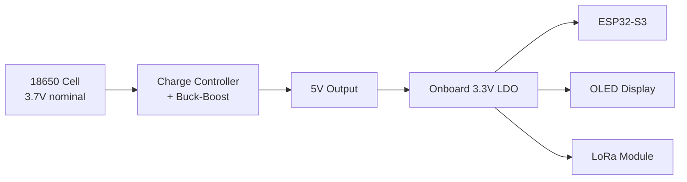

# WeatherKit - Base Station (Handheld Display Unit)

The Base Station is a handheld display unit designed for portable, off-grid survivalist applications. It receives weather data wirelessly from the Sensor Package via LoRa and displays it on an OLED screen, enabling storm tracking and lightning risk assessment in remote outdoor conditions.

## 🎯 Purpose

This compact handheld unit is designed for portable outdoor use and performs the following functions:
- Receive weather data from the Sensor Package via LoRa
- Display real-time weather information on an OLED screen
- Track and visualize storm/lightning data for safety assessment
- Provide user interface for navigation and settings
- Send configuration updates to the Sensor Package
- Manage three-way handshake protocol for reliable data delivery
- Operate on 18650 battery power for extended off-grid use

## 🔧 Hardware

### Microcontroller
- **Waveshare ESP32-S3-Zero**

### Display
- **SSD1306 128x64 OLED** - I2C interface
- Address: 0x3C

### LoRa Module
- **SX1278/RA-02** - 433 MHz LoRa transceiver
- Interface: SPI
- Range: Up to several kilometers (line of sight)

### User Input
- **2x Push Buttons** - Left and Right navigation buttons
- Active low configuration (pressed = GND)

## 📌 Pin Configuration

### I2C Bus (OLED Display)
| Signal | GPIO |
|--------|------|
| SDA | GPIO 1 |
| SCL | GPIO 2 |

### Buttons
| Button | GPIO |
|--------|------|
| Left | GPIO 13 |
| Right | GPIO 12 |

### LoRa Module (SX1278)
| Signal | GPIO |
|--------|------|
| SCK | GPIO 10 |
| MISO | GPIO 9 |
| MOSI | GPIO 8 |
| NSS (CS) | GPIO 7 |
| RST | GPIO 6 |
| DIO0 | GPIO 5 |
| DIO1 | GPIO 4 |

## 📂 Source Code Structure

```
dev/
├── CMakeLists.txt           # Project build configuration
├── README.md                # This file
├── sdkconfig                # ESP-IDF configuration
└── main/
    ├── CMakeLists.txt       # Component build configuration
    ├── main.c               # Application entry point (stub)
    ├── include/
    │   └── pinout.h         # GPIO pin definitions
    ├── drivers/
    │   ├── lora.c/h         # LoRa transceiver driver
    │   └── lora_protocol.h  # Packet definitions
    ├── src/
    │   ├── main.c           # Main application
    │   ├── drivers/         # Display drivers
    │   ├── tasks/           # FreeRTOS task implementations
    │   ├── ui/              # User interface components
    │   └── weather/         # Weather data handling
    ├── tasks/               # Task headers
    └── ui/                  # UI component headers
```

## 🔄 Task Architecture

The Base Station runs five concurrent FreeRTOS tasks:

```
┌─────────────────────────────────────────────────────────────────────────────────┐
│                              Base Station Tasks                                   │
├───────────────┬───────────────┬───────────────┬───────────────┬─────────────────┤
│ LoRa RX Task  │ Weather ACK   │ Config TX     │   UI Task     │  Button Task    │
│  (Priority 6) │   Task (P5)   │  Task (P4)    │  (Priority 4) │  (Priority 5)   │
├───────────────┼───────────────┼───────────────┼───────────────┼─────────────────┤
│ • Receive     │ • Send ACKs   │ • Send config │ • Update      │ • Poll buttons  │
│   WEATHER     │ • Retry on    │   changes     │   display     │ • Debounce      │
│ • Dispatch    │   timeout     │ • Send ping/  │ • Handle      │ • Detect short/ │
│   callbacks   │ • Handle ACK  │   locate      │   weather     │   long press    │
│ • Track       │   confirmation│ • Retry logic │   queue       │ • Trigger UI    │
│   timeouts    │               │               │               │   callbacks     │
└───────────────┴───────────────┴───────────────┴───────────────┴─────────────────┘
```

### LoRa RX Task
- **Priority:** 6 (highest)
- **Stack Size:** 4096 bytes
- **Function:** Continuously listens for incoming LoRa packets
- Dispatches to appropriate callbacks based on packet type
- Tracks sensor connection timeout (120 seconds)

### Weather ACK Task
- **Priority:** 5
- **Stack Size:** 3072 bytes
- **Function:** Sends WEATHER_ACK packets and manages three-way handshake
- Implements retry logic with exponential backoff
- Commits lightning data only after receiving ACK_ACK

### Config TX Task
- **Priority:** 4
- **Stack Size:** 3072 bytes
- **Function:** Transmits configuration changes to sensor
- Handles locate/ping commands
- Implements retry on CONFIG_ACK timeout

### UI Task
- **Priority:** 4
- **Stack Size:** 4096 bytes
- **Function:** Manages OLED display updates
- Receives weather data from queue
- Periodic screen refresh (500ms)

### Button Task
- **Priority:** 5
- **Stack Size:** 3072 bytes
- **Function:** Polls button GPIOs with debouncing
- Detects short press, long press (2s), and both-button press
- Triggers UI navigation callbacks

## 🖥️ User Interface

### Display Pages

The UI consists of multiple pages accessible via button navigation:

| Page | Description |
|------|-------------|
| **Main** | Current temperature, humidity, pressure |
| **Lightning Map** | Visual representation of recent strikes |
| **Calculated** | Derived values (heat index, dew point, etc.) |
| **Storm Tracker** | Historical lightning data and trends |
| **Sensor Status** | Connection info, RSSI, uptime |
| **Settings** | Configuration options |

### Navigation Controls

| Button | Short Press | Long Press |
|--------|-------------|------------|
| **Left** | Select/Toggle | Back/Exit |
| **Right** | Cycle pages/items | Show info/help |
| **Both** | - | Toggle standby mode |

### UI State Machine

```
                         ┌─────────────┐
                         │  Main Pages │◄────────────────┐
                         └──────┬──────┘                 │
                                │                        │
           ┌────────────────────┼────────────────────┐   │
           │                    │                    │   │
           ▼                    ▼                    ▼   │
    ┌─────────────┐     ┌─────────────┐     ┌─────────────┐
    │  Info View  │     │Settings Edit│     │Sensor Scroll│
    └──────┬──────┘     └──────┬──────┘     └─────────────┘
           │                   │
           │            ┌──────┴──────┐
           │            ▼             ▼
           │     ┌─────────────┐ ┌─────────────┐
           │     │LoRa Confirm │ │ About View  │
           │     └─────────────┘ └─────────────┘
           │                          │
           └──────────────────────────┘
```

### Settings Menu

| Setting | Options | Description |
|---------|---------|-------------|
| Update Interval | 5-300 sec | Sensor transmission frequency |
| Adaptive Power | On/Off | Auto-adjust sensor TX power |
| High Power Mode | On/Off | Enable max TX power |
| Brightness | 1-5 | Display brightness level |
| Locate Sensor | Action | Buzzer on sensor package |

## 📡 Communication Protocol

### Incoming Packets (Sensor → Base)

#### WEATHER Packet
Contains:
- Temperature (°C)
- Humidity (%)
- Barometric Pressure (hPa)
- Lightning data (pending strikes, distances, total)
- Configuration echo
- Sensor RSSI
- Uptime

#### WEATHER_ACK_ACK Packet
Confirms:
- Sequence number
- Total lightning count (after clearing)

#### CONFIG_ACK Packet
Echoes applied configuration

### Outgoing Packets (Base → Sensor)

#### WEATHER_ACK Packet
- Received RSSI (for adaptive power)
- Acked sequence number

#### CONFIG Packet
- Update interval
- TX power
- Flags (adaptive, high power, locate buzzer)

## 🔄 Three-Way Handshake

The protocol ensures reliable lightning data delivery:

```
     Sensor                    Base Station
        │                           │
        │──── WEATHER ─────────────►│
        │     (with pending         │  Store pending
        │      lightning data)      │  lightning data
        │                           │
        │◄─── WEATHER_ACK ──────────│
        │     (RSSI, sequence)      │
   Clear│                           │
   pending                          │
   counts│                          │
        │                           │
        │──── WEATHER_ACK_ACK ─────►│
        │     (confirmed)           │  Commit lightning
        │                           │  to storm tracker
```

## 🌩️ Storm Tracking

The Base Station maintains historical lightning data:
- Strike timestamps and distances
- Rolling averages and trends
- Storm intensity classification
- Visual lightning map display

## ⚙️ Configuration

### Display Settings (NVS)
- Brightness level
- Units (metric/imperial)
- Display timeout

### Sensor Configuration (Sent via LoRa)
- Update interval
- Power modes
- Locate buzzer

## � Power System

### 18650 Battery Power
The Base Station is powered by a single 18650 lithium-ion cell with integrated power management:



| Component | Description |
|-----------|-------------|
| **18650 Cell** | 3.7V nominal, 2600-3500mAh typical capacity |
| **Charge Controller** | TP4056 or similar with protection circuitry |
| **Buck-Boost Regulator** | Outputs stable 5V from 2.5V-4.2V input range |
| **Onboard LDO** | ESP32 dev board's 3.3V regulator (fed from 5V) |

## �🛠️ Building & Flashing

```bash
# Set up ESP-IDF environment
. $IDF_PATH/export.sh

# Navigate to base station directory
cd baseStation

# Build the project
idf.py build

# Flash to ESP32-S3
idf.py -p /dev/ttyUSB0 flash

# Monitor serial output
idf.py -p /dev/ttyUSB0 monitor

# Build, flash, and monitor in one command
idf.py -p /dev/ttyUSB0 flash monitor

# Or use the build script from the project root:
./build.sh flash-monitor -p base
```

## 🐛 Debugging

### Serial Output
The base station outputs detailed logs via UART:

```
I (1234) main: WeatherKit Base Station
I (1234) display: OLED initialized (128x64)
I (1234) lora: LoRa initialized at 433 MHz
I (1234) ui: UI initialized
I (1234) main: All tasks started
I (31234) lora_rx: Weather received: 23.5°C, 65%, 1013 hPa
I (31234) weather_ack: Sending ACK for seq 42
```

### Key Log Tags
| Tag | Description |
|-----|-------------|
| `main` | Application startup and status |
| `lora` | LoRa driver operations |
| `lora_rx` | RX task packet reception |
| `weather_ack` | ACK task operations |
| `config_tx` | Config transmission |
| `ui` | UI state changes |
| `buttons` | Button events |
| `storm` | Storm tracker updates |

## 📊 Data Flow

```
                    ┌────────────────────────────────────────┐
                    │            Base Station                 │
                    │                                        │
   LoRa Antenna     │  ┌─────────────┐    ┌──────────────┐  │
        │           │  │ LoRa RX     │───►│ Weather      │  │
        ▼           │  │ Task        │    │ Queue        │  │
┌─────────────┐     │  └──────┬──────┘    └──────┬───────┘  │
│ SX1278      │◄───►│         │                  │          │
│ LoRa Radio  │     │         ▼                  ▼          │
└─────────────┘     │  ┌─────────────┐    ┌──────────────┐  │
                    │  │ Weather ACK │    │ UI Task      │──┼──► OLED
                    │  │ Task        │    └──────▲───────┘  │    Display
                    │  └─────────────┘           │          │
                    │         ▲                  │          │
                    │  ┌──────┴──────┐    ┌──────┴───────┐  │
                    │  │ Config TX   │◄───│ Button Task  │◄─┼─── Buttons
                    │  │ Task        │    └──────────────┘  │
                    │  └─────────────┘                      │
                    │         │                             │
                    │         ▼                             │
                    │  ┌─────────────┐                      │
                    │  │ Storm       │                      │
                    │  │ Tracker     │                      │
                    │  └─────────────┘                      │
                    └────────────────────────────────────────┘
```

## 📚 Related Documentation

- [Project README](../README.md) - Overall project documentation
- [Software Architecture](../docs/SOFTWARE_ARCHITECTURE.md) - Detailed flowcharts
- [Hardware Architecture](../docs/HARDWARE_ARCHITECTURE.md) - Wiring and components
- [Sensor Package README](../sensorPackage/README.md) - Handheld sensor unit

---

**WeatherKit Base Station** - Portable Weather Display Unit for Survivalist Applications
