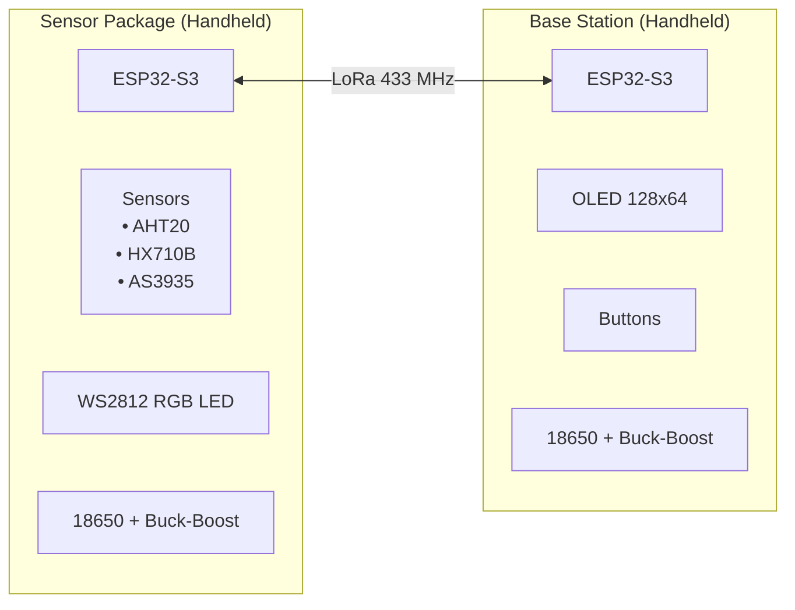
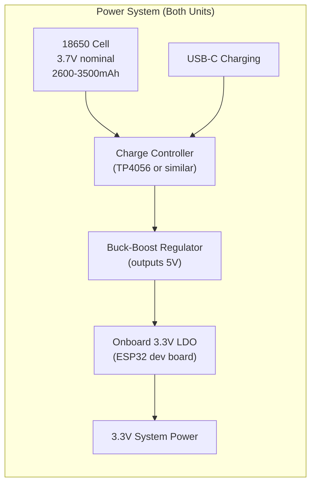

# WeatherKit Hardware Architecture

This document describes the hardware components, wiring connections, and physical design of the WeatherKit portable survivalist weather station system.

---

## System Overview

The WeatherKit is a portable, off-grid weather monitoring system designed for survivalist and outdoor applications. It consists of two handheld microcontroller units that communicate wirelessly:



---

## Sensor Package Hardware

### Microcontroller Unit

| Specification | Value |
|---------------|-------|
| **MCU** | ESP32-S3FH4R2 |
| **Flash** | 4 MB |
| **PSRAM** | 2 MB |
| **Clock** | 240 MHz |
| **Package** | QFN56 |

#### ESP32-S3 GPIO Constraints
- GPIO 0, 3, 45, 46: Strapping pins - avoid
- GPIO 19-20: USB D-/D+ - reserved
- GPIO 26-32: SPI flash - unavailable
- GPIO 33-37: PSRAM - unavailable

### Component List

| Component | Part Number | Interface | Purpose |
|-----------|-------------|-----------|---------|
| MCU | ESP32-S3FH4R2 | - | Main processor |
| Temp/Humidity | AHT20 | I2C | Temperature & humidity sensing |
| Pressure | HX710B | SPI-like | Barometric pressure sensing |
| Lightning | AS3935 | I2C + IRQ | Lightning detection |
| LoRa | SX1278/RA-02 | SPI | Wireless communication |
| Status LED | WS2812B | 1-Wire | Visual status indicator |

### Wiring Diagram

```
                    ESP32-S3FH4R2
                  ┌───────────────────┐
                  │                   │
           3.3V ──┤ 3V3           GND ├── GND
                  │                   │
   AHT20 SDA ─────┤ GPIO 8     GPIO 4 ├───── LoRa SCK
   AHT20 SCL ─────┤ GPIO 9     GPIO 5 ├───── LoRa MISO
                  │                   │
   HX710B DOUT ───┤ GPIO 10    GPIO 6 ├───── LoRa MOSI
   HX710B SCK ────┤ GPIO 11   GPIO 12 ├───── LoRa NSS
                  │                   │
   AS3935 IRQ ────┤ GPIO 7    GPIO 13 ├───── LoRa DIO0
                  │                   │
   WS2812 DATA ───┤ GPIO 48   GPIO 14 ├───── LoRa RST
                  │                   │
                  │       USB         │
                  └─────────┬─────────┘
                            │
                         USB-C
```

### I2C Bus Configuration

| Parameter | Value |
|-----------|-------|
| SDA | GPIO 8 |
| SCL | GPIO 9 |
| Frequency | 80 kHz |
| Pull-ups | 4.7kΩ to 3.3V |

#### I2C Device Addresses
| Device | Address |
|--------|---------|
| AHT20 | 0x38 |
| AS3935 | 0x03 |

### SPI Configuration (LoRa)

| Parameter | Value |
|-----------|-------|
| SCK | GPIO 4 |
| MISO | GPIO 5 |
| MOSI | GPIO 6 |
| NSS (CS) | GPIO 12 |
| Frequency | 1 MHz |
| Mode | Mode 0 (CPOL=0, CPHA=0) |

### AHT20 Temperature/Humidity Sensor

```
    AHT20 Module
    ┌───────────┐
    │   ┌───┐   │
    │   │   │   │
    │   └───┘   │
    │           │
    │ VCC GND   │
    │ SDA SCL   │
    └─┬───┬─┬─┬─┘
      │   │ │ │
    3.3V GND │ │
             │ │
        GPIO8 GPIO9
```

| Pin | Connection |
|-----|------------|
| VCC | 3.3V |
| GND | GND |
| SDA | GPIO 8 |
| SCL | GPIO 9 |

### HX710B Pressure Sensor

The HX710B uses a non-standard SPI-like interface with only clock and data out:

```
    HX710B Module
    ┌───────────┐
    │           │
    │   ┌───┐   │
    │   │ IC│   │
    │   └───┘   │
    │           │
    │VCC GND OUT│
    │    SCK    │
    └─┬───┬──┬──┘
      │   │  │
    3.3V GND │
             │
         GPIO10 (DOUT)
         GPIO11 (SCK)
```

| Pin | Connection |
|-----|------------|
| VCC | 3.3V |
| GND | GND |
| DOUT | GPIO 10 |
| SCK | GPIO 11 |

### AS3935 Lightning Sensor

```
    AS3935 Module
    ┌─────────────────┐
    │                 │
    │    ┌───────┐    │
    │    │ AS3935│    │
    │    └───────┘    │
    │                 │
    │VCC GND SDA SCL  │
    │        IRQ      │
    └─┬───┬───┬───┬───┘
      │   │   │   │
    3.3V GND  │   │
              │   └── GPIO 9 (SCL)
              └── GPIO 8 (SDA)
         IRQ ─── GPIO 7
```

| Pin | Connection |
|-----|------------|
| VCC | 3.3V |
| GND | GND |
| SDA | GPIO 8 (shared I2C) |
| SCL | GPIO 9 (shared I2C) |
| IRQ | GPIO 7 |

### SX1278/RA-02 LoRa Module

```
    RA-02 LoRa Module (Top View)
    ┌─────────────────────────┐
    │ ┌─────────────────────┐ │
    │ │                     │ │
    │ │      SX1278         │ │
    │ │                     │ │
    │ └─────────────────────┘ │
    │                         │
    │  ANT                    │
    │   │                     │
    └───┴─────────────────────┘
    
    Pin Layout:
    ┌─────────────────────────┐
    │ GND  DIO2 DIO1 DIO0 3V3 │
    │ GND  DIO3 DIO4 DIO5 GND │
    │ ANT  RST  NSS  SCK  GND │
    │      MISO MOSI NC   GND │
    └─────────────────────────┘
```

| Pin | Connection | Function |
|-----|------------|----------|
| 3V3 | 3.3V | Power supply |
| GND | GND | Ground |
| SCK | GPIO 4 | SPI Clock |
| MISO | GPIO 5 | SPI Data Out |
| MOSI | GPIO 6 | SPI Data In |
| NSS | GPIO 12 | Chip Select (active low) |
| RST | GPIO 14 | Reset (active low) |
| DIO0 | GPIO 13 | TX/RX Done interrupt |

### WS2812B RGB LED

```
    WS2812B LED
    ┌───────────┐
    │   ┌───┐   │
    │   │LED│   │
    │   └───┘   │
    │           │
    │VCC GND DIN│
    └─┬───┬───┬─┘
      │   │   │
    5V  GND GPIO48
```

| Pin | Connection |
|-----|------------|
| VCC | 5V (from USB) |
| GND | GND |
| DIN | GPIO 48 |

---

## Base Station Hardware

### Microcontroller Unit

| Specification | Value |
|---------------|-------|
| **Board** | Waveshare ESP32-S3-Zero |
| **MCU** | ESP32-S3 |
| **Flash** | 4-16 MB (varies) |
| **Package** | USB-C stamp module |

### Component List

| Component | Part Number | Interface | Purpose |
|-----------|-------------|-----------|---------|
| MCU Board | ESP32-S3-Zero | - | Main processor |
| Display | SSD1306 | I2C | 128x64 OLED display |
| LoRa | SX1278/RA-02 | SPI | Wireless communication |
| Buttons | Tactile switches | GPIO | User input |

### Wiring Diagram

```
                    ESP32-S3-Zero
                  ┌───────────────────┐
                  │                   │
           3.3V ──┤ 3V3           GND ├── GND
                  │                   │
   OLED SDA ──────┤ GPIO 1    GPIO 10 ├───── LoRa SCK
   OLED SCL ──────┤ GPIO 2     GPIO 9 ├───── LoRa MISO
                  │                   │
   Button Left ───┤ GPIO 13    GPIO 8 ├───── LoRa MOSI
   Button Right ──┤ GPIO 12    GPIO 7 ├───── LoRa NSS
                  │                   │
                  │            GPIO 6 ├───── LoRa RST
                  │            GPIO 5 ├───── LoRa DIO0
                  │            GPIO 4 ├───── LoRa DIO1
                  │                   │
                  │       USB         │
                  └─────────┬─────────┘
                            │
                         USB-C
```

### I2C Bus Configuration

| Parameter | Value |
|-----------|-------|
| SDA | GPIO 1 |
| SCL | GPIO 2 |
| Frequency | 400 kHz |
| Pull-ups | Internal or 4.7kΩ |

### SPI Configuration (LoRa)

| Parameter | Value |
|-----------|-------|
| SCK | GPIO 10 |
| MISO | GPIO 9 |
| MOSI | GPIO 8 |
| NSS (CS) | GPIO 7 |
| Frequency | 1 MHz |

### SSD1306 OLED Display

```
    SSD1306 128x64 OLED Module
    ┌─────────────────────────┐
    │ ┌─────────────────────┐ │
    │ │                     │ │
    │ │    128 x 64         │ │
    │ │    OLED Display     │ │
    │ │                     │ │
    │ └─────────────────────┘ │
    │                         │
    │  GND  VCC  SCL  SDA     │
    └───┬────┬────┬────┬──────┘
        │    │    │    │
       GND  3.3V  │    │
                  │    │
             GPIO 2  GPIO 1
```

| Pin | Connection |
|-----|------------|
| GND | GND |
| VCC | 3.3V |
| SCL | GPIO 2 |
| SDA | GPIO 1 |

### Button Wiring

Both buttons use active-low configuration with internal pull-ups:

```
           3.3V (internal pull-up)
             │
             ├──┐
             │  │
    GPIO ────┼──┴──┐
             │     │
             │   ┌─┴─┐
             │   │ SW│ Tactile Switch
             │   └─┬─┘
             │     │
            GND ───┘
```

| Button | GPIO | Pull-up |
|--------|------|---------|
| Left | GPIO 13 | Internal |
| Right | GPIO 12 | Internal |

---

## LoRa Communication

### RF Specifications

| Parameter | Value |
|-----------|-------|
| Frequency | 433 MHz |
| Modulation | LoRa (CSS) |
| Spreading Factor | SF7-SF12 |
| Bandwidth | 125 kHz |
| Coding Rate | 4/5 |
| TX Power | 2-17 dBm (adaptive) |

### Antenna

- **Type:** Quarter-wave whip or helical
- **Length:** ~17 cm for 433 MHz
- **Impedance:** 50Ω
- **Connection:** U.FL or SMA

### Range Considerations

| Environment | Typical Range |
|-------------|---------------|
| Indoor, same floor | 50-100 m |
| Indoor, through walls | 20-50 m |
| Outdoor, line of sight | 1-5 km |
| Outdoor, urban | 200-500 m |

---

## Power Supply

Both units are designed for portable, off-grid operation using 18650 lithium-ion cells.

### 18650 Battery Power System



| Component | Description |
|-----------|-------------|
| **18650 Cell** | 3.7V nominal (2.5V-4.2V range), 2600-3500mAh typical |
| **Charge Controller** | TP4056 or equivalent with battery protection (over-charge, over-discharge, short circuit) |
| **Buck-Boost Regulator** | Outputs stable 5V across full 18650 voltage range (2.5V-4.2V input) |
| **Onboard LDO** | 3.3V regulator on ESP32 dev board (fed from 5V input) |

### Sensor Package Power Budget

| Source | Voltage | Current (typical) | Current (peak) |
|--------|---------|-------------------|----------------|
| 18650 Battery | 3.7V (nom) | 30 mA | 120 mA (TX) |

Power distribution:
- ESP32-S3: 80 mA (active)
- AHT20: 0.2 mA
- HX710B: 1 mA
- AS3935: 60 µA (standby), 3 mA (active)
- LoRa TX: 40 mA @ 10 dBm, 120 mA @ 17 dBm
- WS2812B: 1-60 mA per LED

**Estimated Battery Life:** 24-72 hours continuous operation (depending on TX power and interval)

### Base Station Power Budget

| Source | Voltage | Current (typical) |
|--------|---------|-------------------|
| 18650 Battery | 3.7V (nom) | 50 mA |

Power distribution:
- ESP32-S3: 80 mA (active)
- OLED: 10-15 mA
- LoRa RX: 10 mA

**Estimated Battery Life:** 48-96 hours continuous operation (with display dimming)

---

## PCB Layout Considerations

### Sensor Package

1. **Keep LoRa antenna away from**:
   - I2C bus traces
   - Power supply switching
   - MCU high-speed signals

2. **Ground plane**:
   - Solid ground under LoRa module
   - Keep analog sensor grounds separate

3. **I2C routing**:
   - Keep traces short
   - Route together as differential pair

### Base Station

1. **Display placement**:
   - Keep I2C traces short
   - Avoid routing under display

2. **Button placement**:
   - Consider ergonomic access
   - Keep wires short to GPIO

---

## Enclosure Requirements

Both units are designed for handheld, portable outdoor use in survival and field conditions.

### Sensor Package (Handheld)

| Requirement | Specification |
|-------------|---------------|
| IP Rating | IP54 or higher (splash/dust resistant) |
| Material | Rugged, impact-resistant plastic |
| Ventilation | Breathable membrane for pressure sensor |
| Antenna | Compact helical or stub antenna |
| Battery Access | Easy 18650 replacement |
| Size | Handheld-friendly (~100x60x30mm) |
| Attachment | Lanyard loop or carabiner clip |

### Base Station (Handheld)

| Requirement | Specification |
|-------------|---------------|
| IP Rating | IP54 or higher |
| Display window | Scratch-resistant, clear viewing |
| Button access | Glove-friendly, tactile buttons |
| Antenna | Compact helical or stub antenna |
| Battery Access | Easy 18650 replacement |
| Size | Handheld-friendly (~100x60x35mm) |
| Attachment | Lanyard loop or carabiner clip |

---

## Assembly Notes

### Sensor Package Assembly

1. Mount ESP32-S3 module
2. Connect I2C bus (SDA/SCL with pull-ups)
3. Connect pressure sensor (DOUT/SCK)
4. Connect lightning sensor (I2C + IRQ)
5. Connect LoRa module (SPI)
6. Connect WS2812B LED
7. Attach antenna (after powering on)
8. Test each sensor individually
9. Verify LoRa communication
10. Seal enclosure

### Base Station Assembly

1. Mount ESP32-S3-Zero
2. Connect OLED display (I2C)
3. Connect buttons (with pull-ups)
4. Connect LoRa module (SPI)
5. Attach antenna
6. Test display and buttons
7. Verify LoRa communication
8. Mount in enclosure

---

## Test Points

### Sensor Package

| Test Point | Expected Value |
|------------|----------------|
| 3.3V rail | 3.3V ± 0.1V |
| I2C SDA idle | 3.3V (high) |
| I2C SCL idle | 3.3V (high) |
| LoRa NSS idle | 3.3V (high) |
| LoRa DIO0 | Toggles on TX/RX |

### Base Station

| Test Point | Expected Value |
|------------|----------------|
| 3.3V rail | 3.3V ± 0.1V |
| I2C activity | Visible on scope |
| Button Left pressed | 0V |
| Button Left released | 3.3V |

---

## Troubleshooting

### No LoRa Communication

1. Check antenna connection
2. Verify SPI wiring (SCK, MISO, MOSI, NSS)
3. Check RST pin connection
4. Verify 3.3V power to module
5. Check for correct frequency setting

### I2C Sensor Not Detected

1. Verify pull-up resistors (4.7kΩ)
2. Check SDA/SCL not swapped
3. Verify sensor power (3.3V)
4. Run I2C bus scan
5. Check for address conflicts

### Display Not Working

1. Verify I2C address (0x3C or 0x3D)
2. Check SDA/SCL connections
3. Verify 3.3V power
4. Try display reset

### Button Not Responding

1. Check GPIO configuration (input with pull-up)
2. Verify button wiring (active low)
3. Test with multimeter
4. Check for debounce issues

---

## Bill of Materials

### Sensor Package

| Qty | Component | Part Number | Notes |
|-----|-----------|-------------|-------|
| 1 | ESP32-S3 Module | ESP32-S3FH4R2 | 4MB Flash, 2MB PSRAM |
| 1 | AHT20 Module | - | Temperature/Humidity |
| 1 | HX710B Module | - | Pressure sensor |
| 1 | AS3935 Module | - | Lightning sensor |
| 1 | RA-02 LoRa | SX1278 | 433 MHz |
| 1 | WS2812B LED | - | RGB status |
| 1 | 433 MHz Antenna | - | Compact helical |
| 2 | 4.7kΩ Resistor | - | I2C pull-ups |
| 1 | 18650 Cell | - | Li-ion battery |
| 1 | TP4056 Module | - | Charge controller with protection |
| 1 | Buck-Boost Module | - | 3.3V output, 2.5-5V input |

### Base Station

| Qty | Component | Part Number | Notes |
|-----|-----------|-------------|-------|
| 1 | ESP32-S3-Zero | Waveshare | MCU board |
| 1 | SSD1306 OLED | 0.96" 128x64 | I2C interface |
| 1 | RA-02 LoRa | SX1278 | 433 MHz |
| 2 | Tactile Switch | 6x6mm | Push buttons |
| 1 | 433 MHz Antenna | - | Compact helical |
| 1 | 18650 Cell | - | Li-ion battery |
| 1 | TP4056 Module | - | Charge controller with protection |
| 1 | Buck-Boost Module | - | 3.3V output, 2.5-5V input |

---

## References

- [ESP32-S3 Technical Reference Manual](https://www.espressif.com/sites/default/files/documentation/esp32-s3_technical_reference_manual_en.pdf)
- [SX1278 Datasheet](https://www.semtech.com/products/wireless-rf/lora-connect/sx1278)
- [AHT20 Datasheet](http://www.aosong.com/en/products-32.html)
- [AS3935 Datasheet](https://www.sciosense.com/products/wireless-sensor-tags/as3935-lightning-sensor/)
- [SSD1306 Datasheet](https://cdn-shop.adafruit.com/datasheets/SSD1306.pdf)

---

**WeatherKit Hardware Architecture** - Component Specifications and Wiring Guide for Portable Survivalist Weather Station
