# WeatherKit Software Architecture

This document provides in-depth software architecture flowcharts for both the Base Station (dev) and Sensor Package (sensorPackage) microcontrollers.

---

## System Overview

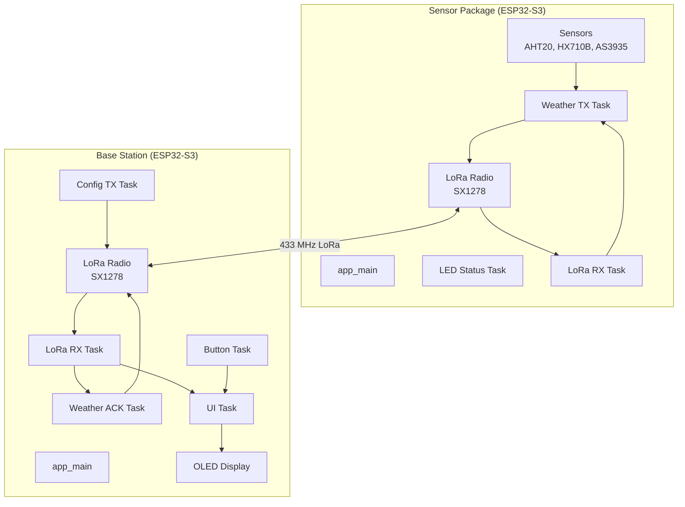

---

## LoRa Communication Protocol (Three-Way Handshake)

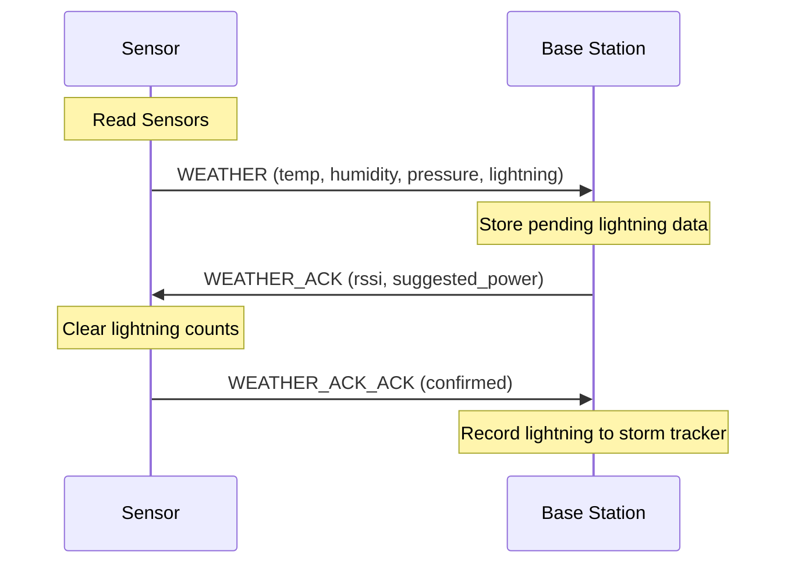

---

# Base Station (dev)

## Main Initialization Flow

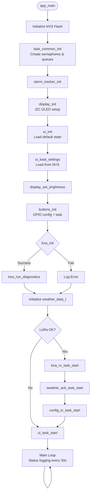

---

## Button Task (buttons.c)

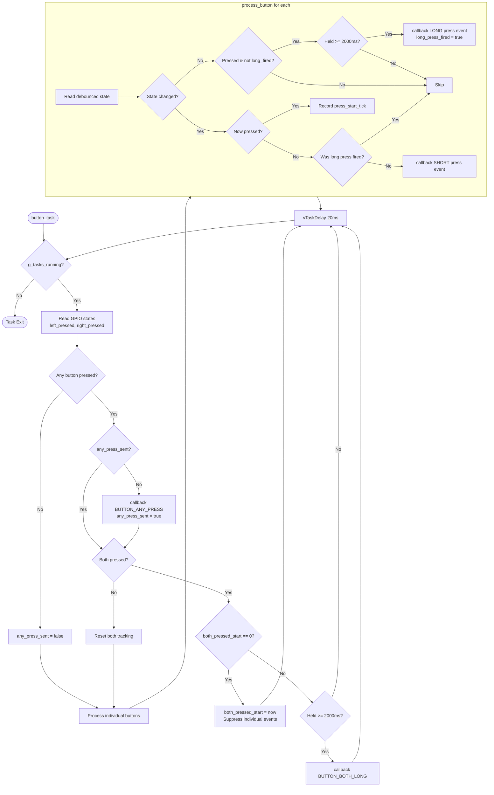

---

## LoRa RX Task (lora_rx_task.c)

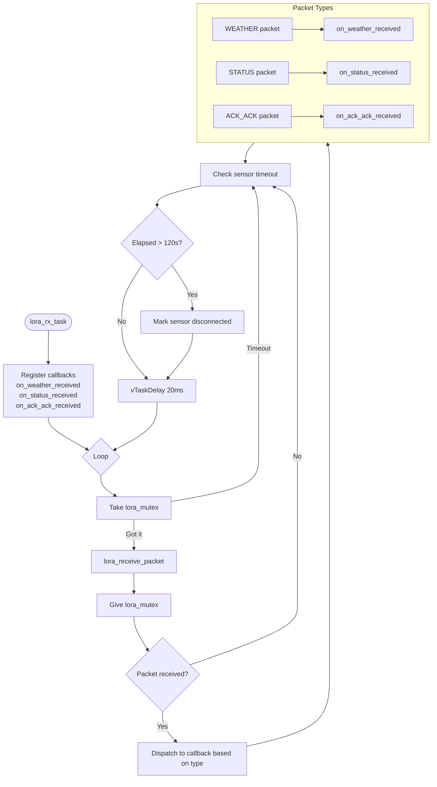

### on_weather_received Callback

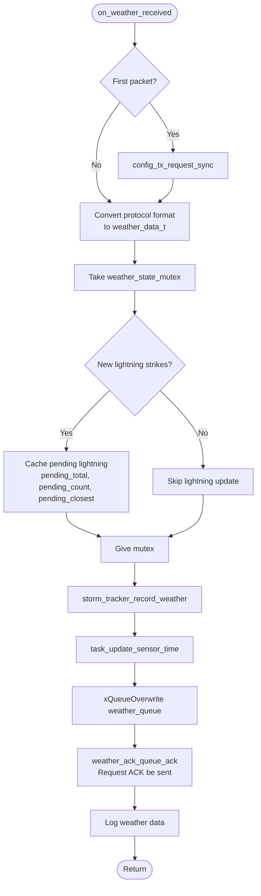

---

## Weather ACK Task (weather_ack_task.c)

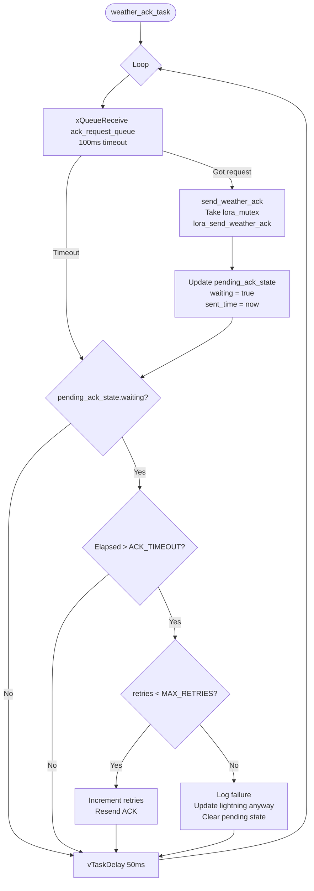

---

## Config TX Task (config_tx_task.c)

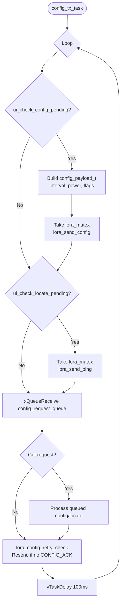

---

## UI Task (ui_task.c)

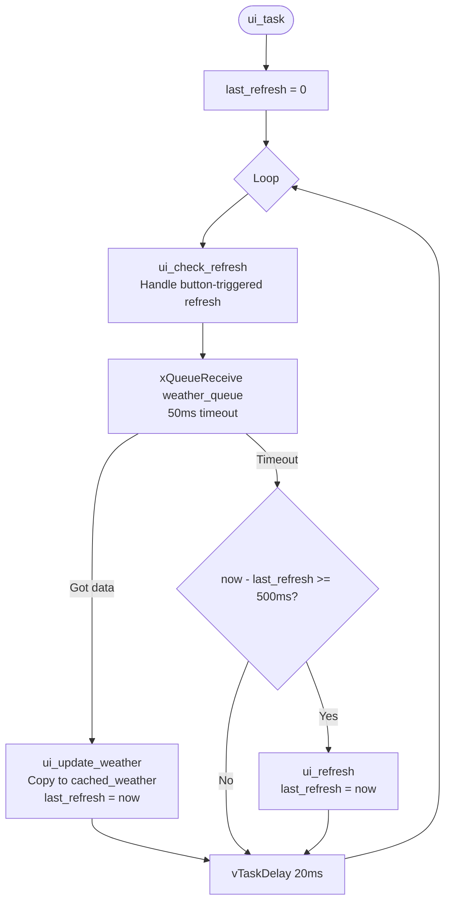

---

## UI Navigation State Machine

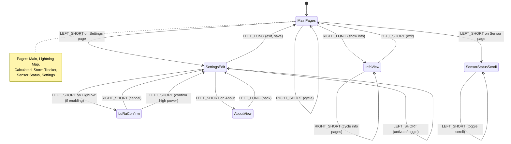

---

# Sensor Package (sensorPackage)

## Main Initialization Flow

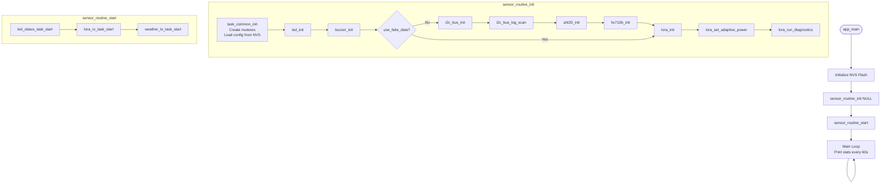

---

## Task Common Init (with NVS Load)

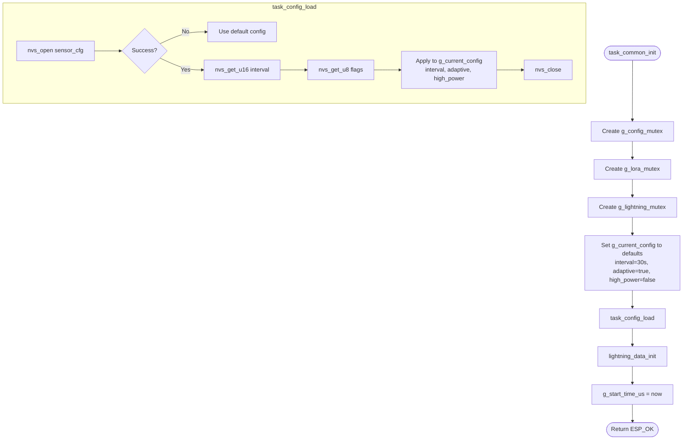

---

## LED Status Task (led_status_task.c)

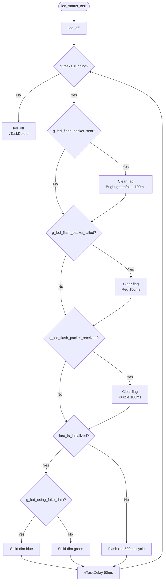

---

## LoRa RX Task - Sensor (lora_rx_task.c)

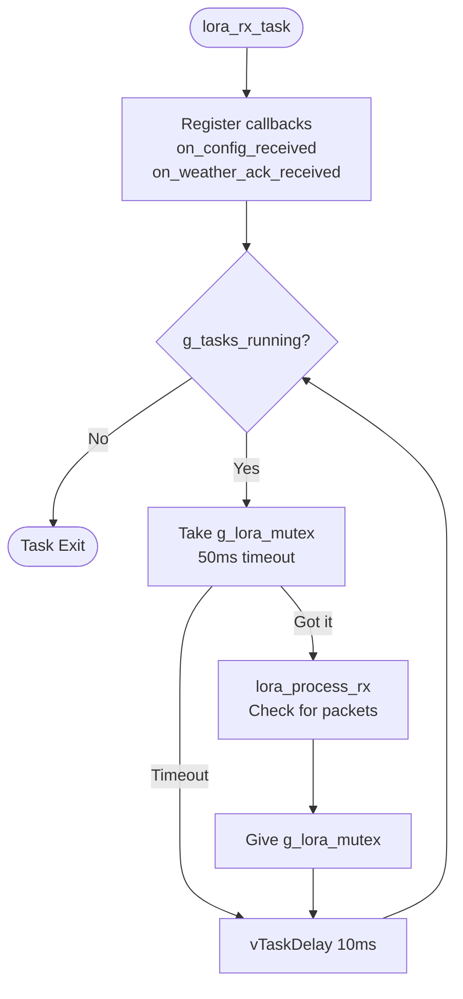

### on_config_received Callback

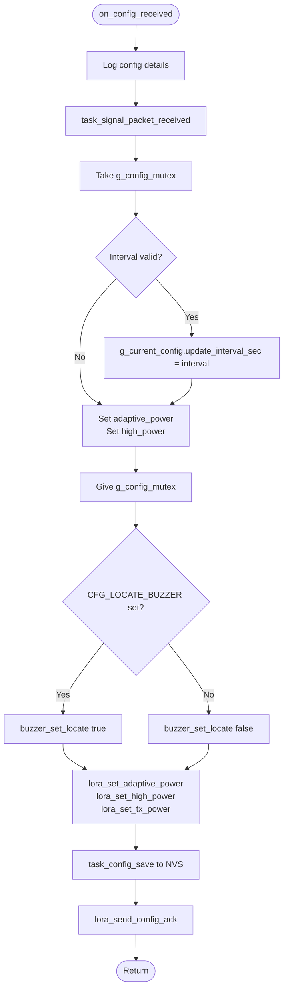

### on_weather_ack_received Callback

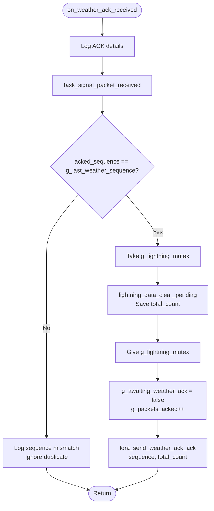

---

## Weather TX Task (weather_tx_task.c)

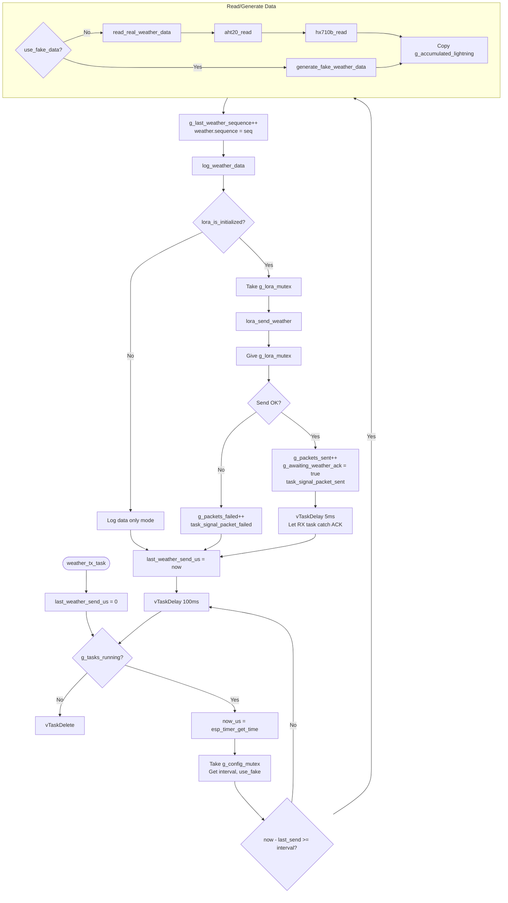

---

## Shared State & Synchronization

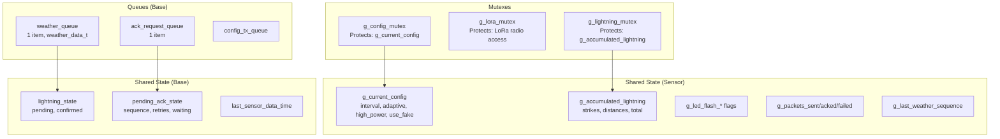

---

## NVS Config Persistence (Sensor)

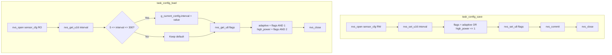

---

## Task Priorities

| Task | Priority | Stack Size | Purpose |
|------|----------|------------|---------|
| **Base Station** |
| button_task | 5 | 3072 | Button polling and events |
| lora_rx_task | 6 | 4096 | LoRa packet reception |
| weather_ack_task | 5 | 3072 | ACK sending and retry |
| config_tx_task | 4 | 3072 | Config/locate transmission |
| ui_task | 4 | 4096 | Display updates |
| **Sensor Package** |
| lora_rx_task | 5 | 4096 | LoRa packet reception |
| weather_tx_task | 4 | 4096 | Sensor reading and TX |
| led_status_task | 3 | 3072 | LED indicators |

---

## Adaptive TX Power Algorithm (Sensor)

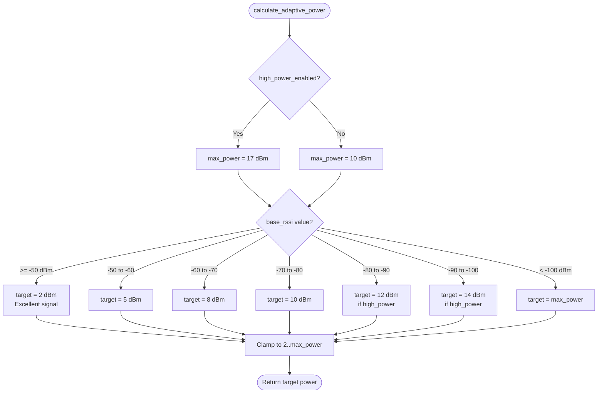

---

## Error Handling

```mermaid
flowchart TD
    subgraph "Sensor Errors (g_sensor_error_flags)"
        TEMP[ERR_TEMP_SENSOR 0x01]
        HUMID[ERR_HUMIDITY_SENSOR 0x02]
        PRESSURE[ERR_PRESSURE_SENSOR 0x04]
        LIGHTNING[ERR_LIGHTNING_SENSOR 0x08]
        LORA[ERR_LORA 0x10]
    end
    
    subgraph "Recovery Actions"
        RETRY[Retry sensor read]
        CONTINUE[Continue with partial data]
        FALLBACK[Use fake data mode]
    end
    
    TEMP --> CONTINUE
    HUMID --> CONTINUE
    PRESSURE --> CONTINUE
    LORA --> FALLBACK
```

---

## Data Flow Summary

```mermaid
graph LR
    subgraph Sensor
        AHT20[AHT20 Temp/Humid] --> WTX[Weather TX Task]
        HX710B[HX710B Pressure] --> WTX
        AS3935[AS3935 Lightning] --> WTX
        WTX --> LORA_S[LoRa Radio]
    end
    
    LORA_S -->|WEATHER| LORA_B
    
    subgraph Base
        LORA_B[LoRa Radio] --> RX[LoRa RX Task]
        RX --> QUEUE[Weather Queue]
        QUEUE --> UI[UI Task]
        UI --> OLED[OLED Display]
        RX --> ACK_TASK[ACK Task]
        ACK_TASK --> LORA_B
        RX --> STORM[Storm Tracker]
        BTN[Buttons] --> UI
        UI --> CFG_TX[Config TX Task]
        CFG_TX --> LORA_B
    end
    
    LORA_B -->|WEATHER_ACK| LORA_S
    LORA_S -->|ACK_ACK| LORA_B
    LORA_B -->|CONFIG| LORA_S
    LORA_S -->|CONFIG_ACK| LORA_B
```

---

## Memory Map

| Resource | Base Station | Sensor Package |
|----------|--------------|----------------|
| **Total Heap** | ~300KB | ~300KB |
| **Stack (all tasks)** | ~18KB | ~11KB |
| **Weather Queue** | ~128 bytes | N/A |
| **NVS Storage** | UI settings | Sensor config |
| **LoRa TX Buffer** | 256 bytes | 256 bytes |
| **LoRa RX Buffer** | 256 bytes | 256 bytes |
