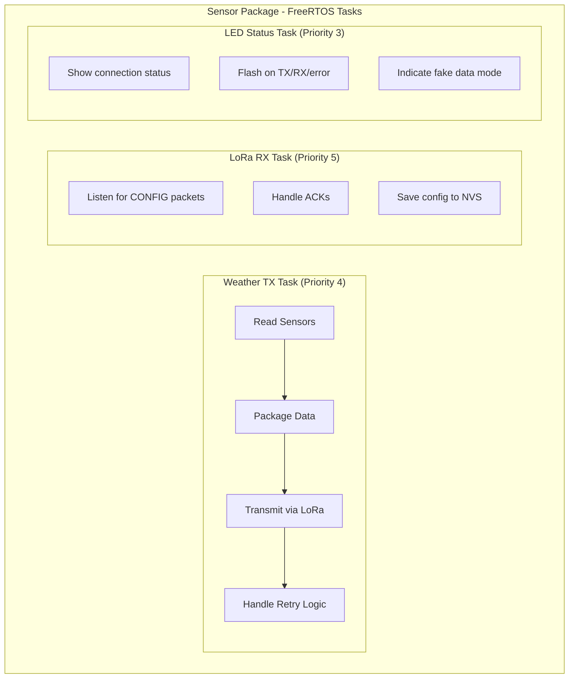
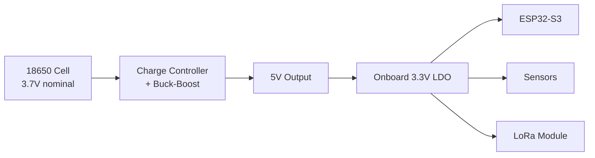
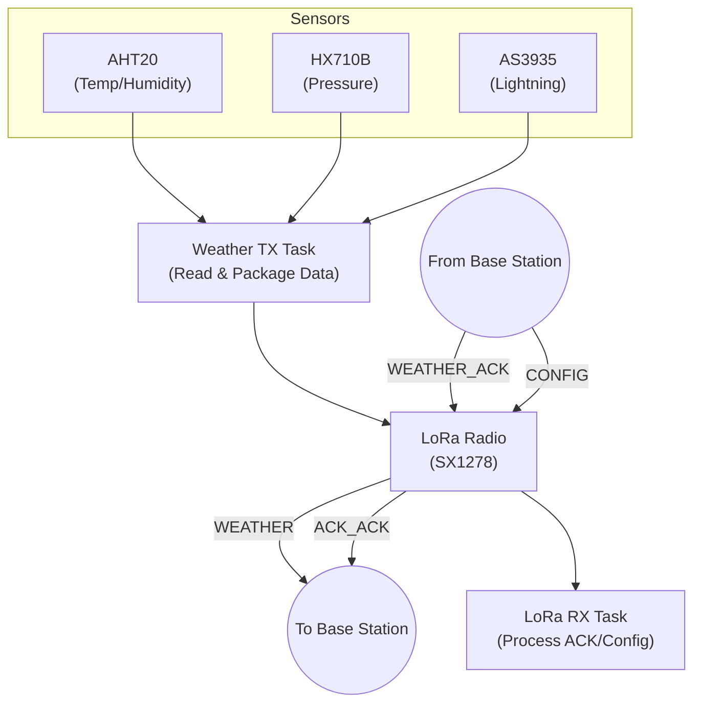

# WeatherKit - Sensor Package (Handheld Sensor Unit)

The Sensor Package is a handheld environmental sensing unit designed for portable, off-grid survivalist applications. It reads environmental data from multiple sensors and transmits it wirelessly to the Base Station via LoRa, enabling storm tracking and lightning risk assessment in remote outdoor conditions.

## 🎯 Purpose

This compact handheld unit is designed for portable outdoor use and performs the following functions:
- Read temperature and humidity from the AHT20 sensor
- Read barometric pressure from the HX710B sensor for storm tracking
- Detect lightning strikes via the AS3935 sensor for safety assessment
- Transmit sensor data to the Base Station via LoRa at configurable intervals
- Receive and apply configuration updates from the Base Station
- Provide visual status feedback via RGB LED
- Operate on 18650 battery power for extended off-grid use

## 🔧 Hardware

### Microcontroller
- **ESP32-S3FH4R2** (4MB Flash, 2MB PSRAM)

### Sensors
| Sensor | Function | Interface | I2C Address |
|--------|----------|-----------|-------------|
| AHT20 | Temperature & Humidity | I2C | 0x38 |
| HX710B | Barometric Pressure | SPI-like | N/A |
| AS3935 | Lightning Detection | I2C + IRQ | 0x03 |

### LoRa Module
- **SX1278/RA-02** - 433 MHz LoRa transceiver
- Interface: SPI
- Range: Up to several kilometers (line of sight)

### Status Indicator
- **WS2812 RGB LED** - Visual status feedback

## 📌 Pin Configuration

### I2C Bus (AHT20, AS3935)
| Signal | GPIO |
|--------|------|
| SDA | GPIO 8 |
| SCL | GPIO 9 |

### Pressure Sensor (HX710B)
| Signal | GPIO |
|--------|------|
| DOUT | GPIO 10 |
| SCK | GPIO 11 |

### Lightning Sensor (AS3935)
| Signal | GPIO |
|--------|------|
| IRQ | GPIO 7 |

### LoRa Module (SX1278)
| Signal | GPIO |
|--------|------|
| SCK | GPIO 4 |
| MISO | GPIO 5 |
| MOSI | GPIO 6 |
| NSS (CS) | GPIO 12 |
| RST | GPIO 14 |
| DIO0 | GPIO 13 |

### RGB LED (WS2812)
| Signal | GPIO |
|--------|------|
| DATA | GPIO 48 |

## 📂 Source Code Structure

```
sensorPackage/
├── CMakeLists.txt           # Project build configuration
├── README.md                # This file
├── sdkconfig                # ESP-IDF configuration
└── main/
    ├── CMakeLists.txt       # Component build configuration
    ├── main.c               # Application entry point
    ├── include/
    │   └── pinout.h         # GPIO pin definitions
    ├── drivers/
    │   ├── led.c/h          # WS2812 RGB LED driver
    │   └── lora.c/h         # LoRa transceiver driver
    ├── src/
    │   ├── main.c           # Alternate main location
    │   ├── sensor_routine.c # Sensor reading routines
    │   ├── drivers/         # Sensor drivers
    │   └── tasks/           # FreeRTOS task implementations
    └── tasks/               # Task headers
```

## 🔄 Task Architecture

The Sensor Package runs three concurrent FreeRTOS tasks:



### Weather TX Task
- **Priority:** 4
- **Stack Size:** 4096 bytes
- **Function:** Periodically reads all sensors, packages the data, and transmits via LoRa
- **Interval:** Configurable (default 30 seconds)

### LoRa RX Task
- **Priority:** 5
- **Stack Size:** 4096 bytes
- **Function:** Listens for incoming packets (CONFIG, WEATHER_ACK)
- Processes acknowledgments and configuration updates
- Saves received configuration to NVS flash

### LED Status Task
- **Priority:** 3
- **Stack Size:** 3072 bytes
- **Function:** Manages the RGB LED to indicate system status
- **Status Indicators:**
  - 🟢 **Solid Green** - Normal operation (real sensors)
  - 🔵 **Solid Blue** - Normal operation (fake data mode)
  - 💚 **Bright Green Flash** - Packet sent successfully
  - 💜 **Purple Flash** - Packet received
  - 🔴 **Red Flash** - Packet send failed
  - 🔴 **Flashing Red** - LoRa not initialized

## 📡 Communication Protocol

### Outgoing Packets (Sensor → Base)

#### WEATHER Packet
Sent at the configured interval containing:
- Temperature (°C, encoded)
- Humidity (%, encoded)
- Barometric Pressure (hPa, encoded)
- Lightning data (strike count, distances, total)
- Configuration echo (for base station display)
- RSSI feedback (for adaptive power)
- Uptime (minutes)
- Sequence number

#### WEATHER_ACK_ACK Packet
Sent after receiving WEATHER_ACK to confirm data commitment:
- Sequence number
- Total lightning count (after clearing pending)

#### CONFIG_ACK Packet
Sent after receiving and applying CONFIG:
- Echoed configuration values

### Incoming Packets (Base → Sensor)

#### WEATHER_ACK Packet
- RSSI value (used for adaptive power calculation)
- Acked sequence number

#### CONFIG Packet
- Update interval (seconds)
- TX power setting
- Flags (adaptive power, high power mode, locate buzzer)

## ⚙️ Configuration

### Configurable Parameters

| Parameter | Range | Default | Description |
|-----------|-------|---------|-------------|
| `update_interval_sec` | 5-300 | 30 | Seconds between transmissions |
| `adaptive_power` | bool | true | Auto-adjust TX power based on RSSI |
| `high_power` | bool | false | Enable 17dBm max TX power |
| `use_fake_data` | bool | false | Use simulated sensor data |

### NVS Storage
Configuration is persisted to NVS flash under namespace `sensor_cfg`:
- Key `interval` (u16): Update interval
- Key `flags` (u8): Bit flags for adaptive_power, high_power

## 🔋 Power System

### 18650 Battery Power
The Sensor Package is powered by a single 18650 lithium-ion cell with integrated power management:



| Component | Description |
|-----------|-------------|
| **18650 Cell** | 3.7V nominal, 2600-3500mAh typical capacity |
| **Charge Controller** | TP4056 or similar with protection circuitry |
| **Buck-Boost Regulator** | Outputs stable 5V from 2.5V-4.2V input range |
| **Onboard LDO** | ESP32 dev board's 3.3V regulator (fed from 5V) |

### Adaptive TX Power
When enabled, the sensor automatically adjusts transmission power based on received RSSI feedback:

| Base RSSI | TX Power |
|-----------|----------|
| ≥ -50 dBm | 2 dBm (excellent signal) |
| -50 to -60 | 5 dBm |
| -60 to -70 | 8 dBm |
| -70 to -80 | 10 dBm |
| -80 to -90 | 12 dBm (if high_power) |
| -90 to -100 | 14 dBm (if high_power) |
| < -100 dBm | Max power |

## 🛠️ Building & Flashing

```bash
# Set up ESP-IDF environment
. $IDF_PATH/export.sh

# Navigate to sensor package directory
cd sensorPackage

# Build the project
idf.py build

# Flash to ESP32-S3
idf.py -p /dev/ttyUSB0 flash

# Monitor serial output
idf.py -p /dev/ttyUSB0 monitor

# Build, flash, and monitor in one command
idf.py -p /dev/ttyUSB0 flash monitor
```

## 🐛 Debugging

### Serial Output
The sensor package outputs detailed logs via UART:

```
I (1234) main: WeatherKit Sensor Package
I (1234) main: NVS initialized
I (1234) lora: LoRa initialized at 433 MHz
I (1234) main: Sensor package running!
I (1234) main: - Weather data interval: 30 seconds
I (1234) main: - Adaptive power: enabled
I (1234) main: - Data source: real sensors
I (61234) main: Stats: sent=10, acked=10, failed=0, uptime=1 min
```

### Error Flags
The system tracks sensor errors via `g_sensor_error_flags`:
- `0x01` - Temperature sensor error
- `0x02` - Humidity sensor error
- `0x04` - Pressure sensor error
- `0x08` - Lightning sensor error
- `0x10` - LoRa error

### Fake Data Mode
For testing without sensors, enable fake data mode:
- Generates realistic simulated weather data
- LED shows solid blue instead of green
- Useful for protocol testing

## 📊 Data Flow



## 📚 Related Documentation

- [Project README](../README.md) - Overall project documentation
- [Software Architecture](../docs/SOFTWARE_ARCHITECTURE.md) - Detailed flowcharts
- [Hardware Architecture](../docs/HARDWARE_ARCHITECTURE.md) - Wiring and components
- [Base Station README](../baseStation/README.md) - Handheld display unit

---

**WeatherKit Sensor Package** - Portable Environmental Monitoring Unit for Survivalist Applications
